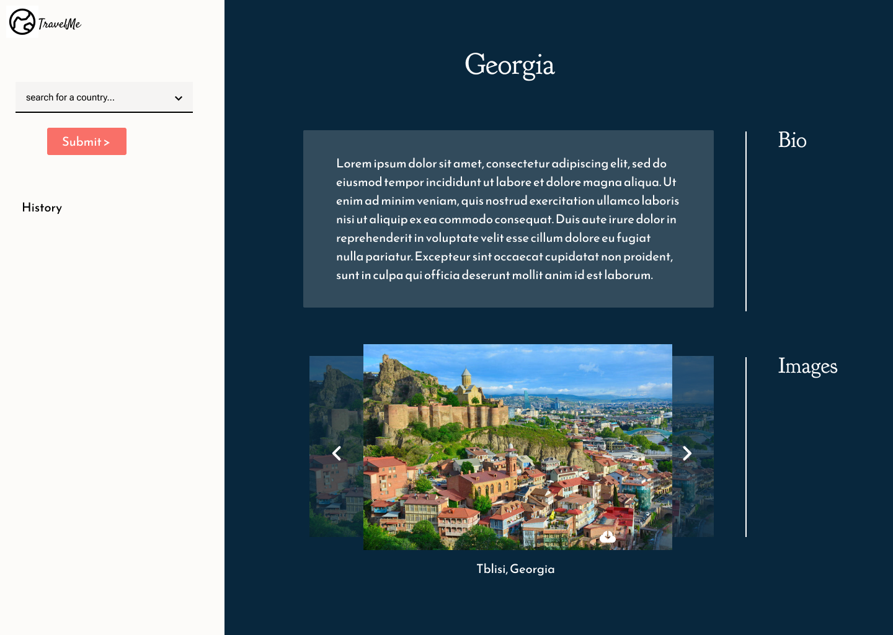

# Travel Me App
# User Story
* As a traveller, I want to stay informed on relevant information for tourists in specific countries. I want to select a country in the application, and have the choice to see various general information such as the details, national flag, see images and a short bio of the country. Additionally, I can choose the country I am based in, and see the current currency exchange between my country and my destination country.

# Description
* An application where a user can choose from the dropdown for a travel destination (country) and see description of country, images and currancy exchange rate. The search history its stored in the local storage.

* We used three apis for this project (total of 4 calls) We called the wiki api twice for page content and once for a flag. At the same time we call the unsplash api for nice photos (this feature also allows user to download the images) And if the user decides to check out the currency conversion rate then we make a call to the ExchangeRate Api to grab the conversion.

* Media Wiki - https://www.mediawiki.org/wiki/API:Main_page
* Unsplash - https://unsplash.com/developers
* Exchange - https://www.exchangerate-api.com/docs/overview

* Tech stack used - tailwind css, tailwind modal, google font and bootstrap slider

* Enjoy!

# Screenshot

# Live Site
https://johnxlai.github.io/travel-app/
